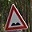
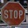
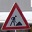

#**Traffic Sign Recognition** 

##Writeup Template

###You can use this file as a template for your writeup if you want to submit it as a markdown file, but feel free to use some other method and submit a pdf if you prefer.

---

**Build a Traffic Sign Recognition Project**

The goals / steps of this project are the following:
* Load the data set (see below for links to the project data set)
* Explore, summarize and visualize the data set
* Design, train and test a model architecture
* Use the model to make predictions on new images
* Analyze the softmax probabilities of the new images
* Summarize the results with a written report

[//]: # (Image References)

[image1]: ./examples/visualization.jpg "Visualization"
[image2]: ./examples/grayscale.jpg "Grayscaling"
[image3]: ./examples/random_noise.jpg "Random Noise"
[image4]: ./examples/placeholder.png "Traffic Sign 1"
[image5]: ./examples/placeholder.png "Traffic Sign 2"
[image6]: ./examples/placeholder.png "Traffic Sign 3"
[image7]: ./examples/placeholder.png "Traffic Sign 4"
[image8]: ./examples/placeholder.png "Traffic Sign 5"

## Rubric Points
###Here I will consider the [rubric points](https://review.udacity.com/#!/rubrics/481/view) individually and describe how I addressed each point in my implementation.  

| Specification | Criteria | Requirements | References  | Meets Specification |
| --- | --- | --- | --- | --- |
| Files Submitted | Submission Files | The project submission includes all required files | Includes ipython file (html & ipynb) and markup file | Yes |
| Dataset Exploration | Dataset Summary | The submission includes a basic summary of the data set. | Section 1.1 | Yes |
| Dataset Exploration | Exploratory Visualization | The submission includes an exploratory visualization on the dataset. | Section 1.2 | Yes |
| Design and Test a Model Architecture | Preprocessing | The submission describes the preprocessing techniques used and why these techniques were chosen | Section 2.1 | Yes |
| Design and Test a Model Architecture | Model Architecture |The submission provides details of the characteristics and qualities of the architecture, such as the type of model used, the number of layers, the size of each layer. Visualizations emphasizing particular qualities of the architecture are encouraged. | Section 2.2 | Yes |
| Design and Test a Model Architecture | Model Training | The submission describes how the model was trained by discussing what optimizer was used, batch size, number of epochs and values for hyperparameters. | Section 2.3 | Yes |
| Design and Test a Model Architecture | Solution Approach | The submission describes the approach to finding a solution. Accuracy on the validation set is 0.93 or greater. | Section 2.3 | Yes |
| Test a Model on New Images | Acquiring New Images | The submission includes five new German Traffic signs found on the web, and the images are visualized. Discussion is made as to any particular qualities of the images or traffic signs in the images that may be of interest, such as whether they would be difficult for the model to classify. | Section 3.1 | Yes |
| Test a Model on New Images | Performance on New Images | The submission documents the performance of the model when tested on the captured images. The performance on the new images is compared to the accuracy results of the test set. | Section 3.2 and 3.3 | Yes |
| Test a Model on New Images | Model Certainty - Softmax Probabilities | The top five softmax probabilities of the predictions on the captured images are outputted. The submission discusses how certain or uncertain the model is of its predictions. | Section 3.4 | Yes |

---
###Writeup / README

####1. Provide a Writeup / README that includes all the rubric points and how you addressed each one. You can submit your writeup as markdown or pdf. You can use this template as a guide for writing the report. The submission includes the project code.

Here is a link to my modified [project code](https://github.com/zippau/CarND-P2-TrafficSignClassifier/Traffic_Sign_Classifier.html)

###Data Set Summary & Exploration

####1. Provide a basic summary of the data set and identify where in your code the summary was done. In the code, the analysis should be done using python, numpy and/or pandas methods rather than hardcoding results manually.

The code for this step is contained in the Section 1.1 of the IPython notebook.  

I used the numpy library to calculate summary statistics of the traffic signs data set:

* The size of training set is 34799
* The size of test set is 12630
* The shape of a traffic sign image is 32 x 32 x 3
* The number of unique classes/labels in the data set is 43

####2. Include an exploratory visualization of the dataset and identify where the code is in your code file.

The code for this step is contained in Section 1.2 of the IPython notebook.  

Here is an exploratory visualization of the data set. It is a bar chart showing how many signs of each type are in the training dataset.

###Design and Test a Model Architecture

####1. Describe how, and identify where in your code, you preprocessed the image data. What tecniques were chosen and why did you choose these techniques? Consider including images showing the output of each preprocessing technique. Pre-processing refers to techniques such as converting to grayscale, normalization, etc.

The code for this step is contained in Section 2.1 of the IPython notebook.

As a first step, I decided to create a switch, so I could test whether certain pre-processing would improve the modelling results.

The first step involved checking the image size, to ensure it was the right size and channel depth.

The second step was to visualise an image, to make sure I was importing the images correctly, and so I could see how light/dark they were.

The third step was to randomise (shuffle) the dataset, so improve the randomness of error.

The fourth Step was to denoise/normalise the image.

The fifth step was to grayscale the image, and return a value for number of channels for the modified image.

####2. Describe how, and identify where in your code, you set up training, validation and testing data. How much data was in each set? Explain what techniques were used to split the data into these sets. (OPTIONAL: As described in the "Stand Out Suggestions" part of the rubric, if you generated additional data for training, describe why you decided to generate additional data, how you generated the data, identify where in your code, and provide example images of the additional data)

My final training set had 34799 number of images. My validation set and test set had 4410 and 12630 number of images, respectively.

I decided to see how the model went, before applying modification or augmentation of the datasets. The model provided a high level of accuracy, so no further changes were made. Augmentaiton (like flipping the data or amending the amount within the training set) would have occured if higher accuracy (for most real life experiences) was required.

####3. Describe, and identify where in your code, what your final model architecture looks like including model type, layers, layer sizes, connectivity, etc.) Consider including a diagram and/or table describing the final model.

The code for my final model is located in Section 2.2 of the ipython notebook. 

My final model consisted of the following layers:

| Layer         		|     Description	        					| 
|:---------------------:|:---------------------------------------------:| 
| Input         		| 32 x 32 x n_channel image   					| 
| Convolution 3x3     	| 1x1 stride, valid padding, outputs 28x28x6 	|
| Activation			| Relu											|
| Max pooling	      	| 2x2 stride,  outputs 14x14x6	 				|
| Normalisation			| Normalisation									|
| Convolution 3x3	    | 1x1 stride, valid padding, outputs 10x10x16   |
| activation            | Relu											|
| Normalisation         | Normalisation									|
| pooling               | 2x2 stride,  outputs 5x5x16	 				|
| Flatten               | Output 400									|
| Fully connected		| Output 120  									|
| Activation            | Relu											|
| Fully connected		| Output 84  									|
| Activation            | Relu											|
| Fully connected		| Output 43   									|
| Softmax				| Probabilities 								|

 

####4. Describe how, and identify where in your code, you trained your model. The discussion can include the type of optimizer, the batch size, number of epochs and any hyperparameters such as learning rate.

The code for training the model is located in the eigth cell of the ipython notebook. 

To train the model, I started using paramets set out in the practice examples. My aim was to optimise the run time to meet the basic accuracy rates set out within the documentation. In this aim, I decided to leave all the parameters as default, and tune each of them to see if them improved the run time. I investigated batch size, learning rate and epochs in that order. 

I decided not to tune the hyperparameters because I need to undertake more research into what impact each will have.

In my trial and error, increasing the batch size (to 256), learning rate (0.01) and decreasing epochs all reduced the accuracy of the model. Because of this I left the batch size as 128, learning rate as 0.001 and increased epochs to 40. This improved the overall accuracy of the model.

In future I will try to tune the hyperparameters and investigate other model structures that improve the model further (I left my model investigation to adding minor normalisation which drastically improved accuracy).

####5. Describe the approach taken for finding a solution. Include in the discussion the results on the training, validation and test sets and where in the code these were calculated. Your approach may have been an iterative process, in which case, outline the steps you took to get to the final solution and why you chose those steps. Perhaps your solution involved an already well known implementation or architecture. In this case, discuss why you think the architecture is suitable for the current problem.

The code for calculating the accuracy of the model is located in Section 2.3 of the Ipython notebook.

My final model results were:
* training set accuracy of 100%
* test set accuracy of 95.0%
* validation set accuracy of 95.3% 

If an iterative approach was chosen:
* What was the first architecture that was tried and why was it chosen?
* What were some problems with the initial architecture?
* How was the architecture adjusted and why was it adjusted? Typical adjustments could include choosing a different model architecture, adding or taking away layers (pooling, dropout, convolution, etc), using an activation function or changing the activation function. One common justification for adjusting an architecture would be due to over fitting or under fitting. A high accuracy on the training set but low accuracy on the validation set indicates over fitting; a low accuracy on both sets indicates under fitting.
* Which parameters were tuned? How were they adjusted and why?
* What are some of the important design choices and why were they chosen? For example, why might a convolution layer work well with this problem? How might a dropout layer help with creating a successful model?

If a well known architecture was chosen:
* What architecture was chosen?
AlexNet

* Why did you believe it would be relevant to the traffic sign application?
Adding local normalisation steps improves generalisation, as the normalisation process helps to account for brightness of images ^(1). This is why it is relevant to the varying brightness of images in the dataset.
(1) http://papers.nips.cc/paper/4824-imagenet-classification-with-deep-convolutional-neural-networks.pdf

* How does the final model's accuracy on the training, validation and test set provide evidence that the model is working well? 
Not only did it predict all signs currectly, but the softmax percentages were extremely high.
 

###Test a Model on New Images

####1. Choose five German traffic signs found on the web and provide them in the report. For each image, discuss what quality or qualities might be difficult to classify.

Here are five German traffic signs that I found on the web:

   
 

The images were retrieved from the internet, as such there will be difficulties for the model to classify these images. The difficulties include, rotation angle of the sign, different brightness, background colours and side-angle direction of one of the images.

####2. Discuss the model's predictions on these new traffic signs and compare the results to predicting on the test set. Identify where in your code predictions were made. At a minimum, discuss what the predictions were, the accuracy on these new predictions, and compare the accuracy to the accuracy on the test set (OPTIONAL: Discuss the results in more detail as described in the "Stand Out Suggestions" part of the rubric).

The code for making predictions on my final model is located in the tenth cell of the Ipython notebook.

Here are the results of the prediction:

| Image			        |     Prediction	        					| 
|:---------------------:|:---------------------------------------------:| 
| No Entry      		| No Entry   									| 
| Bumpy Road  			| Bumpy Road									|
| Stop					| Stop											|
| Road work	      		| Road work 					 				|
| Wild animal crossing	| Wild animal crossing     						|

The model was able to correctly guess 5 of the 5 traffic signs, which gives an accuracy of 100%. This compares favorably to the accuracy on the test set of 94.5%

####3. Describe how certain the model is when predicting on each of the five new images by looking at the softmax probabilities for each prediction and identify where in your code softmax probabilities were outputted. Provide the top 5 softmax probabilities for each image along with the sign type of each probability. (OPTIONAL: as described in the "Stand Out Suggestions" part of the rubric, visualizations can also be provided such as bar charts)

The code for making predictions on my final model is located in Section 3.4 of the Ipython notebook.

For the first image, the model is relatively sure that this is a no entry sign (probability of 0.99), and the image does contain a no entry sign. The top three soft max probabilities were

| Probability         	|     Prediction	        					| 
|:---------------------:|:---------------------------------------------:| 
| .99999         		| No entry sign   								| 
| .00000     			| Stop sign										| 
| .00000				| Bicycles crossing								| 
| .00000				| Speed limit (30km/h)							|
| .00000				| Road work sign								| 

For the second image, the model is relatively sure that this is a bumpy sign (probability of 0.96), and the image does contain a bumpy sign. The top three soft max probabilities were

| Probability         	|     Prediction	        					| 
|:---------------------:|:---------------------------------------------:| 
| .94096         		| Bumpy Road   									| 
| .05820     			| Bicycles crossing								| 
| .00082				| Road work sign								| 
| .00000				| Road narrows on the right						|
| .00000				| General caution								| 

For the third image, the model is relatively sure that this is a stop sign (probability of 0.99), and the image does contain a stop sign. The top three soft max probabilities were

| Probability         	|     Prediction	        					| 
|:---------------------:|:---------------------------------------------:| 
| .99918         		| Stop sign										| 
| .00066     			| Speed limit (60km/h)							|
| .00012				| No vehicles									| 
| .00004				| Speed limit (80km/h)							| 
| .00000				| Children crossing								| 

For the fourth image, the model is relatively sure that this is a road work sign (probability of 0.99), and the image does contain a road work sign. The top three soft max probabilities were

| Probability         	|     Prediction	        					| 
|:---------------------:|:---------------------------------------------:| 
| .71987         		| Road work sign								| 
| .27958    			| Bumpy Road   									| 
| .00054				| Bicycles crossing								| 
| .00000				| Road narrows on the right						|
| .00000				| Children crossing								| 

For the fifth image, the model is relatively sure that this is a Wild animals crossing sign (probability of 0.99), and the image does contain a Wild animals crossing sign. The top three soft max probabilities were

| Probability         	|     Prediction	        					| 
|:---------------------:|:---------------------------------------------:| 
| .99997         		| Wild animals crossing   						| 
| .00003     			| Double curve									| 
| .00000				| Slippery road									| 
| .00000				| Dangerous curve to the left					| 
| .00000				| Bicycles crossing								| 

